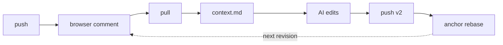
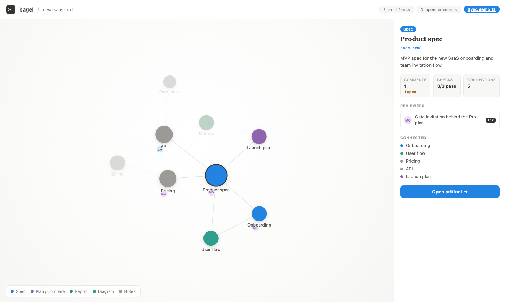
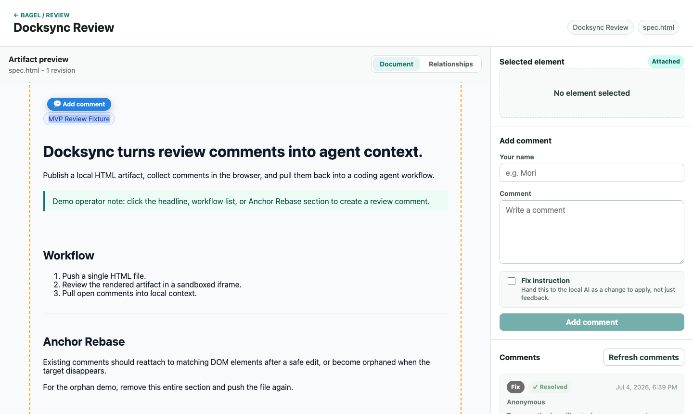
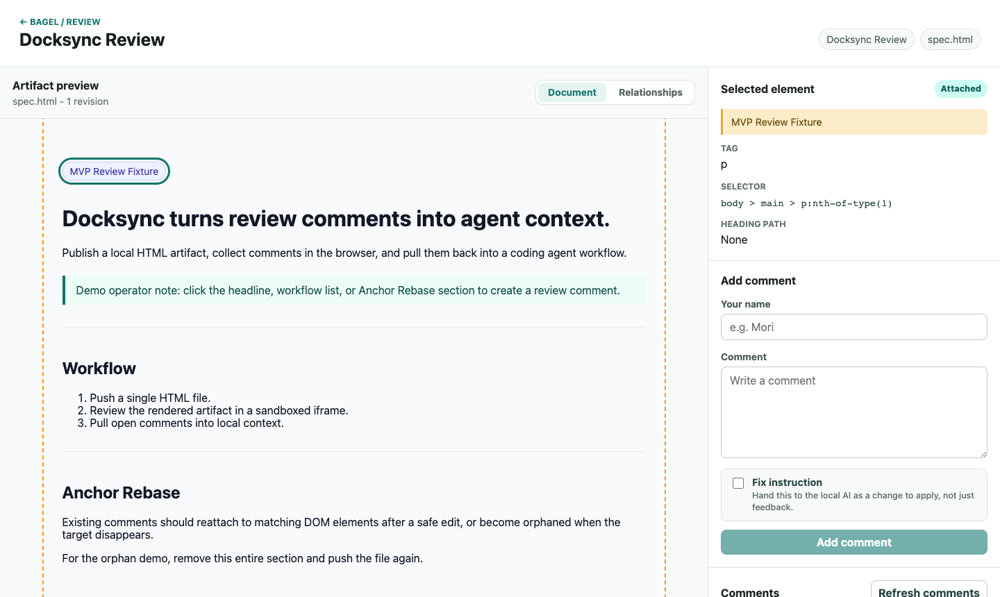

# bagel

**Turn browser review comments on AI-generated HTML into agent context your local AI can act on.**

bagel is a localhost-first review loop for HTML artifacts (specs, dashboards,
UI mocks, plans). You publish an artifact, reviewers comment on DOM elements or
text ranges in the browser — optionally as *fix instructions* — and you pull
those comments back as structured Markdown context for your coding agent
(Claude Code, Codex, Cursor, …). When the AI pushes a revised version, Anchor
Rebase reattaches existing comments to the new DOM.





## Screens

| Screen | Route | What it does |
|---|---|---|
| **Workspace graph** | `/` | Force-directed map of your artifacts: color = type, size = connections, reviewer avatars orbit their artifact. Click a node to inspect it and open its review. |
| **Review** | `/r/<token>` | The artifact in a sandboxed iframe. Click an element or select text to get an **Add comment** pill; toggle **Fix instruction** to hand the comment to the AI as a change to apply. Comments can be resolved/reopened. A **Relationships** tab shows the artifact's impact scope on the same graph. |
| **Sync loop** | `/sync` | *Demo:* a scripted replay of `pull → AI patch → v3→v4 diff → comments resolved`. Not yet wired to a real run. |

Select text to comment on exactly what you mean — the quote (with context)
travels with the comment and survives revisions:




## Requirements

- Node.js 22 or newer
- npm
- `cloudflared` — only for `bagel share` (remote reviewers)

## Quickstart

```sh
git clone https://github.com/1ppe1/bagel.git
cd bagel
npm install
npm run dev          # API on :8787, web on :5173
```

In another terminal, publish the demo artifact and the workspace graph:

```sh
./bagel push examples/spec.html --server http://127.0.0.1:8787
./bagel workspace --server http://127.0.0.1:8787
```

Open the review URL printed by `push` (or open `http://127.0.0.1:5173/` and
click the artifact's node). Add a comment — try selecting text and toggling
**Fix instruction** — then pull it into agent context:

```sh
./bagel pull
./bagel context --open-comments
cat .docsync/context.md
```

Fix instructions arrive marked for direct application:

```markdown
### cmt_… (fix instruction)

- Kind: Fix instruction
- Selector: `main > h1`
- Text quote: "Docksync turns review comments into agent context."
- Fix instruction: Rename the headline to be more concrete
- Suggested instruction: Apply this change directly to the referenced section, …
```

Point your coding agent at `.docsync/context.md`, let it edit the HTML, then
`./bagel push` the new version — open comments are re-anchored (or marked
`orphaned` when their target disappeared).

## Sharing with remote reviewers

Your artifacts stay on your machine. To let someone on another network review:

```sh
./bagel share
```

This starts a [Cloudflare quick tunnel](https://developers.cloudflare.com/cloudflare-one/connections/connect-networks/do-more-with-tunnels/trycloudflare/)
(no account needed) and prints a public `https://…trycloudflare.com` URL plus
your review URL. Anyone with the link can review; stop sharing with `Ctrl+C`.

What stays protected while sharing:

- Review URLs are unguessable capability tokens (192-bit, stored only as hashes).
- The workspace manifest can only be overwritten from the local machine —
  tunneled `POST /api/workspace` requests are rejected.
- Write endpoints are rate-limited per client IP.

## CLI

```text
bagel init                Create a local .docsync configuration.
bagel push <file.html>    Publish a single HTML file for review.
bagel pull                Sync review comments into .docsync/comments.json.
bagel context             Generate .docsync/context.md for open comments.
bagel workspace [file]    Push a workspace graph manifest.
bagel share               Expose the local server through a quick tunnel.
```

Local state lives under `.docsync/` (`config.json`, `comments.json`,
`context.md`, `api-storage.json`). The workspace graph is described by a
manifest — see [`examples/workspace.json`](examples/workspace.json).

## Security model

bagel treats every artifact as untrusted input, even if you generated it
yourself:

- Artifacts render only inside a **sandboxed iframe** (`allow-scripts`, opaque
  origin) behind a strict, nonce-scoped CSP.
- `push` refuses HTML containing `<script>`, inline event handlers,
  `javascript:` URLs, or embedded `iframe`/`object`/`form` elements:

  ```sh
  ./bagel push examples/unsafe-script.html
  # Security check failed: Artifact contains a <script> tag.
  ```

- The browser never writes to your filesystem and never runs your AI — the CLI
  owns all local side effects.

See [.docs/security.md](.docs/security.md) for design notes.

## Development

```sh
npm run dev        # API + web dev servers
npm run build      # type-check, web bundle, scaffold check
npm test           # node --test suite
```

npm-workspaces monorepo: `apps/api` (Hono), `apps/web` (React + Vite),
`packages/cli`, `packages/core` (contracts, anchor extraction, Anchor Rebase).
CI runs build + tests on every push and PR.

## Status & roadmap

Working today: the full localhost loop (push → comment → pull → context →
re-push with anchor rebase), workspace graph, fix instructions, resolve/reopen,
remote sharing via quick tunnel.

Planned next: wiring `/sync` to real runs, auto-generating the workspace
manifest, live comment updates, npm distribution (`npx bagel`).

## License

[MIT](LICENSE)
